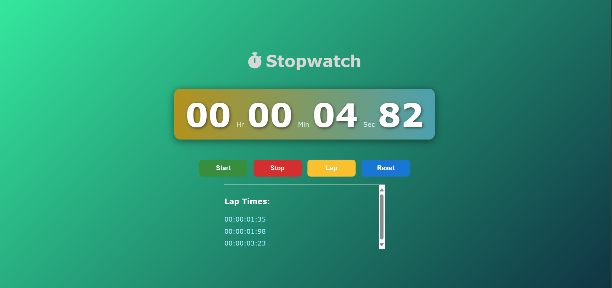

# 🕒  Stopwatch web application

An elegant and responsive stopwatch web application built using **HTML**, **CSS**, and **JavaScript**. The application features an interactive design with animated components and supports start, stop, reset, and lap recording functionalities.

---

## 🌟 Features

- **Start, Stop, and Reset**: Core stopwatch functionalities.
- **Lap Tracking**: Record and display lap times.
- **Responsive Design**: Works seamlessly on desktop and mobile devices.
- **Animated UI**: Smooth animations for an enhanced user experience.
- **Interactive Timer Display**: Visually appealing timer interface.

---

## 📂 Project Structure

- **index.html**: The main HTML file containing the structure of the stopwatch.
- **style.css**: The CSS file responsible for styling and animations.
- **script.js**: The JavaScript file for stopwatch logic and interactivity.

---

## 📸 Preview



---

## 🚀 How to Run

1. Clone this repository:
   ```bash
   git clone https://github.com/AttarAlisha/stopwatch_web_project.git
